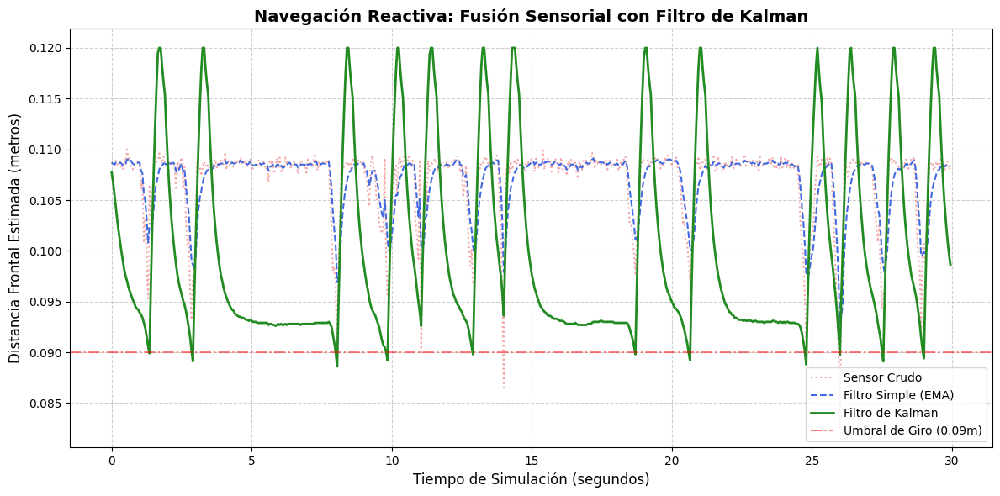

# Laboratorio 2 ICI4150-1: Navegación reactiva con filtrado y fusión de sensores

**Integrantes:** Ignacio Carrillo R.

**Curso:** ICI4150-1 Robótica y Sistemas Autónomos

# Introducción

La **navegación** es una característica fundamental para un sistema robótico autónomo. Esta propiedad depende fuertemente de la capacidad del robot para percibir y procesar su entorno, además de las acciones que realice en tiempo real en base a la información que entregan los sensores. Pero estas herramientas de percepción, cuando se usan en el mundo real, suelen presentar ruido e incertidumbre, por lo que el dato "puro" no es suficiente.

Para resolver el problema del ruido se emplean diferentes estrategias: combinación de sensores, técnicas de estimación o **algoritmos de filtrado**. Uno de los algoritmos que son útiles para filtrar el ruido de una medición es el **filtro de Kalman**.

En este laboratorio se busca aplicar el filtro de Kalman para producir estimaciones más estables bajo diferentes contextos. Con el uso de simulaciones de un robot diferencial (e-puck) en diferentes escenarios, se implementa una estrategia de navegación reactiva basada en la percepción. El sistema implementado usa la odometría de un robot, es decir, un avance estimado con encoders, y las lecturas de los sensores frontales infrarrojos en un esquema de fusión sensorial con Kalman, logrando que el robot estime con precisión la proximidad de obstáculos y mejorando sus decisiones de movimiento a diferencia de otros métodos de filtrado.

# Objetivos

El objetivo central del laboratorio es implementar un sistema simple de navegación reactiva con un e-puck en la plataforma de simulación Webots, usando sensores de distancia y encoders, aplicando un filtrado de Kalman para estimar la distancia de obstáculos frontales y **mejorar la toma de desiciones y navegación del robot**.

Los objetivos específicos a considerar son:

- Adquirir datos, con cierta frecuencia de muestreo, de los sensores frontales, laterales y encoders de ruedas del e-puck.
- Estimar el movimiento y avance del robot mediante odometría (giro angular de los encoders) para un modelo de predicción.
- Implementar un filtro de Kalman con sus dos etapas: predicción (movimiento del robot) y corrección (medición del entorno).
- Desarrollar reglas de decisión usando la distancia calculada por Kalman para estimar cuando debe avanzar o girar ante un obstáculo.
- Graficar y realizar una comparación de los datos crudos del sistema, las señales con un filtro simple aplicado y la estimación final de Kalman.

# Descripción del robot y entorno de simulación

Las pruebas realizadas en este laboratorio se realizaron en la plataforma de simulación **Webots**, un entorno virtual que permite crear, implementar y diseñar escenarios de simulación, robots y controladores con código.

El robot móvil que se utilizó en las pruebas fue un **e-puck**, un sistema que cuenta con dos ruedas, sensores infrarrojos y encoders de alta precisión. 

Respecto a los sensores del e-puck, se activaron los siguientes dispositivos con tal de permitir la percepción y navegación reactiva del robot:

- **Sensores de distancia:** Se utilizaron para detectar la presencia de obstáculos. Estos se dividen en: **sensores frontales** (ubicados en la parte frontal del robot, los cuales actuaron como la principal fuente de datos para el filtrado de Kalman y se determinan como `ps0` y `ps7` en el controlador) y **sensores laterales** (se posicionan a los lados del e-puck, se utilizaron para decidir la dirección del giro evasivo y se determinan, para el lado derecho e izquierdo, como `ps2` y `ps5`).
- **Encoders de ruedas:** Se usaron los encoders, o sensores de posición, de la rueda izquierda y derecha. Los encoders permiten **medir el desplazamiento angular** en radianes, lo que permite calcular el avance lineal del e-puck gracias a la relación $s = r \theta$, donde $s$ es el desplazamiento lineal, $r$ es el radio de la rueda y $\theta$ es el desplazamiento angular medido por el encoder. Los datos del encoder **son valiosos para la fase de predicción del filtro de Kalman**.

Se estableció una **frecuencia de muestreo** para los sensores con tal de asegurar estabilidad en el filtrado de Kalman y obtener una respuesta de control adecuada. Los valores establecidos son:

- **Tiempo de muestreo ($T_s$):** 0.05 segundos o 50 ms.
- **Frecuencia de muestreo ($f_s$):** 20 Hz.

Con esta configuración se reducen los errores de la odometría y permite al controlador procesar las señales, actualizar sus estimaciones y tomar decisiones sincronizadas con el entorno virtual.

# Desarrollo e implementación

A continuación entraremos en detalle sobre el proceso de diseño del controlador, desde una perspectiva teórica y el procesamiento de señales simples hasta la implementación completa de un algoritmo de fusión sensorial.

## Estimación del avance con encoders

Para lograr la predicción con el filtro, se implementó un sistema de **odometría simple** que transforma el movimiento angular de las ruedas en desplazamiento lineal del robot. Con el radio de la rueda del e-puck ($r = 0.0205 m$), se aplicó la relación $s = r \cdot \theta$, donde $\theta$ es la diferencia de posición registrada por los encoders entre cada paso. El avance neto o $\Delta d$ se calculó con el promedio del desplazamiento de ambas ruedas, entregando una estimación de cuánto debería haber cambiado la distancia hacia el obstáculo frontal

## Análisis de señales y Filtro Simple 

Las lecturas "puras" o crudas de los sensores presentan fluctuaciones debido al ruido de la simulación y la sensibilidad de los receptores. Para suavizar esas señales, se implementó un filtro de **Media Móvil Exponencial** o **EMA**, el cual le da mayor valor a los datos recientes y menos a los antiguos de forma exponencial. 

Se utilizó un factor de suavizado $\alpha = 0.2$ en la ecuación:

$y_k = a \cdot z_k + (1 - \alpha) \cdot y_{k - 1}$

Se observó que, mediante el análisis de los datos registrados, aunque el filtro EMA estabiliza la señal, se introduce un retraso o latencia significativo que afecta la integridad del robot al realizar maniobras de alta velocidad, es decir, existe una alta posibilidad de el robot choque contra los obstáculos.

## Implementación del Filtro de Kalman

El **Filtro de Kalman** es un algoritmo recursivo que combina las mediciones de un sensor con un modelo matemático, ponderando la confianza en cada uno para reducir la **incertidumbre**. Se usa el filtro de Kalman en este laboratorio para lograr una estimación más robusta y reactiva de la distancia frontal. El algoritmo se divide en dos etapas, ya mencionadas anteriormente:

- **Etapa de predicción:** Se proyectó la nueva distancia estimada ($\hat{d}_{k}^{-}$) restando el avance lineal ($\Delta d$) a la estimación anterior. Se actualizó la incertidumbre del sistema sumando el ruido del proceso ($Q$). Para evitar divergencias matemáticas ante movimientos bruscos, la predicción se acotó a los límites físicos del sensor infrarrojo (entre 0.01 y 0.12 metros).
- **Etapa de corrección:** Se calculó la **Ganancia de Kalman** ($K_k$), factor de peso que determina cuánto debe confiar el filtro en la nueva medición, comparando la incertidumbre de la predicción frente al ruido de la medición ($R$). Finalmente, se ajustó la predicción con la lectura real del sensor para obtener la distancia actualizada ($\hat{d}_k$).

Para obtener una respuesta más óptima, se establecieron los parámetros a $Q = 0.0005$ y $R = 0.02$, priorizando la velocidad de respuesta sobre la suavidad.

## Lógica de Navegación Reactiva

Las decisiones tomadas por el robot se basan en la distancia estimada por el filtro de Kalman y el umbral de seguridad (0.04 metros), con dos posibles estados:

1. **Estado de avance y centrado:** Si la distancia frontal estimada se mantiene por encima del umbral de seguridad, el robot avanza. Además, se implementa una corrección lateral continua: si los sensores laterales detectan paredes a menos de 7 cm, el controlador aplica una corrección diferencial a las ruedas (`lateral_correction = 0.3`). Esto permite que el robot se auto-centre dinámicamente y navegue por pasillos estrechos fluidamente, evitando colisiones laterales en "zig-zag".
2. **Estado de evasión:** Si la distancia frontal estimada (o la lectura cruda promediada de seguridad) cae por debajo del umbral, se bloquea el estado de avance y se activa una maniobra evasiva obligatoria, la cual se divide en tres fases:

   A) **Retroceso:** El robot invierte ambas marchas para despegarse físicamente del obstáculo y evitar puntos ciegos contra los que podría chocar.
   B) **Giro:** El robot rota sobre su propio eje, evaluando los sensores laterales, para dirigir el escape hacia la zona con mayor espacio libre.
   C) **Continuar:** El robot retoma el avance hacia adelante gradualmente antes de devolver el control al estado de avance principal.

En casos excepcionales, donde el robot se encuentra con una pared larga y se queda en modo de evasión por un largo tiempo, se implementa un giro de "emergencia" que lo ayuda a salir de ese obstáculo. 

Esta lógica de navegación permite que el e-puck pueda moverse de forma ininterrumpida y sin problemas de oscilación o en las esquinas (chattering).

# Resultados y desempeño en escenarios de prueba

Con un controlador especializado que implementa todo lo presentado en las secciones anteriores (revisar `controlador.py` para mayor información del controlador), se puso a prueba el e-puck en dos entornos de simulación en Webots. Los resultados de esas pruebas se pueden visualizar en los vídeos dentro de la carpeta `media`. 

## Análisis Gráfico de la Fusión Sensorial

Para comprobar la efectividad de la estimación de Kalman y el comportamiento del robot, se extrajeron los datos de navegación durante el periodo de prueba continuo (30 segundos) en el entorno con obstáculos simples (ver `escenario_simple.mp4` para comparar con el gráfico) y se graficaron las tres señales principales (crudo, EMA, Kalman):

Al observar la gráfica, podemos dividir el gráfico en secciones: 1) Encuentro con primer obstáculo (0-5 segundos), 2) Encuentro con segundo obstáculo (8-15 segundos), 3) Encuentro con pared (18-22 segundos) y 4) Encuentro con tercer obstáculo (25-30 segundos). El e-puck se comporta de forma similar en cada uno de los obstáculos:

1. **Reacción del Filtro de Kalman (Predicción):** En cada aproximación a un obstáculo, la estimación del Filtro de Kalman (línea verde) cruza el umbral de seguridad de 0.09m de forma casi simultánea a la señal cruda, incluso la cruza primero. Por el contrario, el filtro de Media Móvil (EMA, línea azul punteada) presenta una latencia severa; si el robot dependiera del EMA, la orden de giro llegaría demasiado tarde, provocando una colisión segura.
2. **Maniobra Evasiva (Retroceso):** La maniobra evasiva del e-puck se representa con esa "V" cerca del umbral de giro. Esto es evidencia gráfica de la fase de retroceso de la maniobra evasiva, la cual estabiliza la distancia y aleja al robot de la pared antes de ejecutar el giro.
3. **Acotamiento Matemático (Clamping):** Tras cada evasión, la señal del Filtro de Kalman se estabiliza limpiamente en un techo de 0.12 m. Esto demuestra que la restricción matemática implementada en el estado de predicción y actualización funciona correctamente, evitando que la varianza diverja hacia valores infinitos o físicamente imposibles al perder de vista un obstáculo de forma brusca.
4. **Centrado Dinámico:** En los periodos de avance, la línea verde no se mantiene estática en 0.12 m, sino que navega fluidamente alrededor de los 0.095 m - 0.009 m cuando no hay obstáculos cerca. Esto valida visualmente el éxito de la corrección lateral continua, demostrando que el robot está detectando las paredes a lo lejos y ajustando su trayectoria milimétricamente.

## Resultados en los Escenarios de Prueba

El controlador fue evaluado en dos escenarios distintos: simple (pocos obstáculos) y complejo (varios obstáculos). El desempeño del e-puck en esos escenarios se pueden visualizar en los vídeos `escenario_simple.mp4` y `escenario_complejo.mp4` de la carpeta `media`. Los resultados en aquellos escenarios se describen como:

### Escenario simple (pocos obstáculos):

- **Movimiento estable:** En espacios abiertos, se nota que el robot mantiene una trayectoria relativamente estable. El robot requiere de 2 a 5 giros para esquivar un obstáculo cuadrado por completo, cosa que podría mejorar. La implementación de la corrección diferencial a las ruedas (lateral_correction) otorga al e-puck un comportamiento que lo aleja progresivamente de las paredes. En ningún momento choca contra un obstáculo.
- **Capacidad para evitar colisiones:** La detección temprana del umbral (9 cm) garantizó un margen de maniobra amplio. El robot nunca llegó a impactar físicamente los obstáculos frontales.

### Escenario complejo (varios obstáculos y pasillos estrechos):

- **Giro rápido y forzado:** El e-puck realiza una maniobra de evasión rápida contra cualquier obstáculo o pared, girando casi en 90 grados en algunos casos, lo que evita que se quede atrapado en modo evasión con un obstáculo largo. En caso de que lo anterior sucediera, existe el modo de evasión de emergencia para sacarlo de esa situación.
- **Desempeño del giro:** Al retroceder primero, evaluar el espacio más despejado y rotar agresivamente durante el tiempo bloqueado por el temporizador, el e-puck demostró ser capaz de escapar de esquinas cerradas y trampas geométricas de forma fluida, reanudando su marcha solo cuando la vía estaba garantizadamente libre.

# Conclusiones

# ¿Cómo ejecutar la simulación en Webots?
